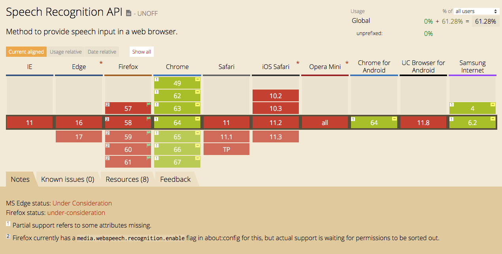
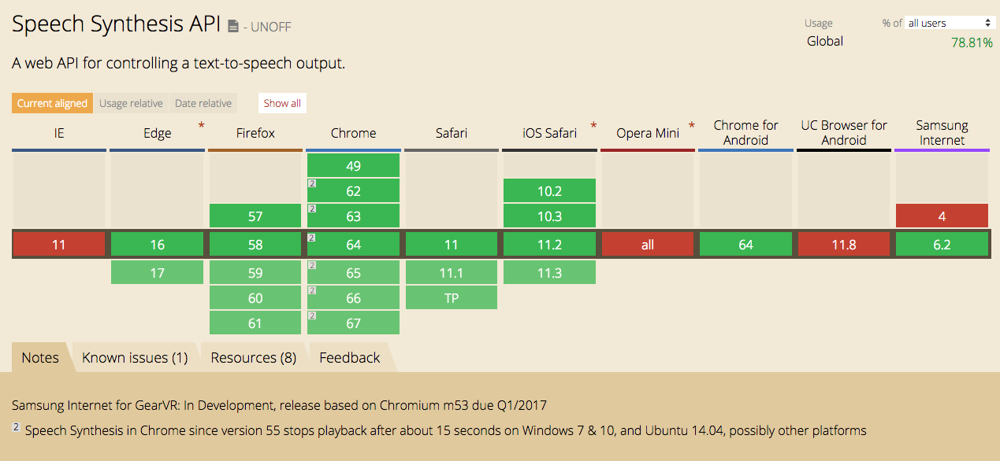

### ブラウザではじめる音声UI
#### Web Speech API
---
スマートスピーカーが流行っていますね
---
少しだけ音声インターフェースが  
普及してきたと思います
---
W3Cでも音声インターフェイスについては  
2012年に仕様が策定されています
---
ただし、W3Cで公式に策定されてなくて  
コミュニティグループによるレポートという扱いです
---
### ブラウザの対応状況
---
### 音声認識

---
### 音声合成

---
音声認識はほとんどのブラウザでは使えません...
---
### Web Speech API
---
音声認識と音声合成を  
WEBページに組み込むためのAPIです
---
### 音声認識  
#### speech recognition interface
---
こんなことができます
---
１. 入力された音声から文脈を認識
---
### サンプルコード
---
```
window.SpeechRecognition = window.SpeechRecognition || webkitSpeechRecognition
const recognition = new webkitSpeechRecognition()
recognition.lang = 'ja'
recognition.interimResults = true
recognition.continuous = true

recognition.onresult = (e) => {
  var results = event.results
  for (var i = event.resultIndex i<results.length i++){
    if(results[i].isFinal)
      document.getElementById('result_text').innerHTML = results[i][0].transcript
    else
      document.getElementById('result_text').innerHTML = "*** "+ results[i][0].transcript
  }
}
```
---
２. デバイスのマイクから入力された音声を  
　　　検知するための複数のイベントハンドラー
---
### サンプルコード
---
```
// recognition start
recognition.onsoundstart = function(){
  document.getElementById('status').innerHTML = "認識中"
}
// recognition no match
recognition.onnomatch = function(){
  document.getElementById('status').innerHTML = "もう一度試してください"
}
// recognition error
recognition.onerror= function(){
  document.getElementById('status').innerHTML = "エラー"
}
// recognition end
recognition.onsoundend = function(){
  document.getElementById('status').innerHTML = "停止中"
}
```
---
３. JSpeech Grammar Format（JSGF）を  
　　　使用して文法を定義  
---
（´-\`）.｡oO（文法？）
---
```
SpeechGrammar
音声認識サービスに認識させたい単語または単語パターンの設定を表します。
```
<small>MDNより</small>
---
### 音声合成  
#### speech synthesis interface
---
こんなことができます
---
１. プログラムが文章の内容を読み取る
---
２. 文章を読み上げる
---
３. 多種類の音声タイプ
---
設定できる項目が多いので、ざっと紹介
---
#### 発話の言語を取得および設定
#### SpeechSynthesisUtterance.lang

BCP47で定義された言語タグで指定できる
---
#### 発話される音程を取得または設定
#### SpeechSynthesisUtterance.pitch

0〜2の範囲で設定。初期値は1。
---
#### 発話される速度を取得および設定
#### SpeechSynthesisUtterance.rate

0.1〜10の範囲で設定。初期値は1。
---
#### 発話したときに合成されるテキストを取得または設定
#### SpeechSynthesisUtterance.text

最大32,767文字まで
---
#### 発話のために使用される音声を取得して設定
#### SpeechSynthesisUtterance.voice

※ SpeechSynthesis.getVoices()で取得できる  
SpeechSynthesisVoiceオブジェクト
---
#### 発話される音量を取得または設定
#### SpeechSynthesisUtterance.volume

0〜1の範囲で設定。初期値は1。  
ということは音量を小さくはできるけど、大きくはできない
---
このAPIをつかうと、こんなことができます
---
### オーディオブック
http://
---
### 対話型コマース
http://
---
### 音声操作
http://
---
音声認識や合成のクラウドサービスはいくつかありますが  
ブラウザ標準の機能になったときには  
画面の制約から解放されたWEBサービスが  
登場するとおもしろいですね
---
ご静聴ありがとうございました
